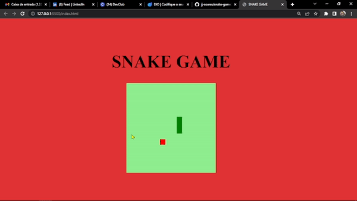
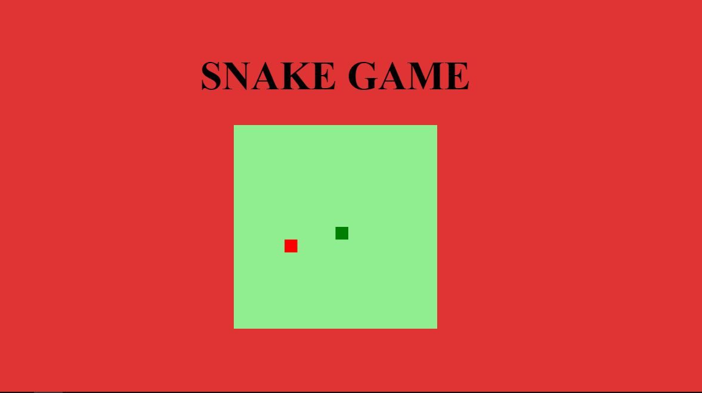

<h1 align="center">
   🐍SNAKE-GAME🐍
</h1>

<h4 align="center">
  💻Jogo simples da cobrinha para relembrar grandes momentos da infancia 
</h4>

   
   <a href="#sobre">Sobre</a> .
   <a href="#roadmap">Roadmap</a> .
   <a href="#tecnologias">Tecnologias</a> .
   <a href="#fotos">Fotos</a> . 
   <a href="#autor">Autor</a>
 

   
 # Sobre
     
     
   
 Esse e um projeto de recriação do jogo da cobrinha, para a conclusão do curso da Digital Innovation One.  

   
   
   
   
   
   # Roadmap 
   
   
 Estava com bastante saudade dos jogos que marcaram a epoca de 90, quando resolvi 
   fazer essa aplicação, por mais que seja simples e com certeza divertido demais e testa 
   suas habilidades! 

   
   
   # Tecnologias 
   <h3 align="center"> Tecnolgias usadas no projeto </h3>
  
HTML

  
CSS

  
Java Script

   
   
   # Fotos 
   

   
   
   

   # Autor 
   
Ola, meu nome e Joao.   Me siga no <a href="https://www.linkedin.com/in/joao-soares-339642215/" target="_blank">Linkedin</a> para ver mais sobre os projeos que posto.!

   
