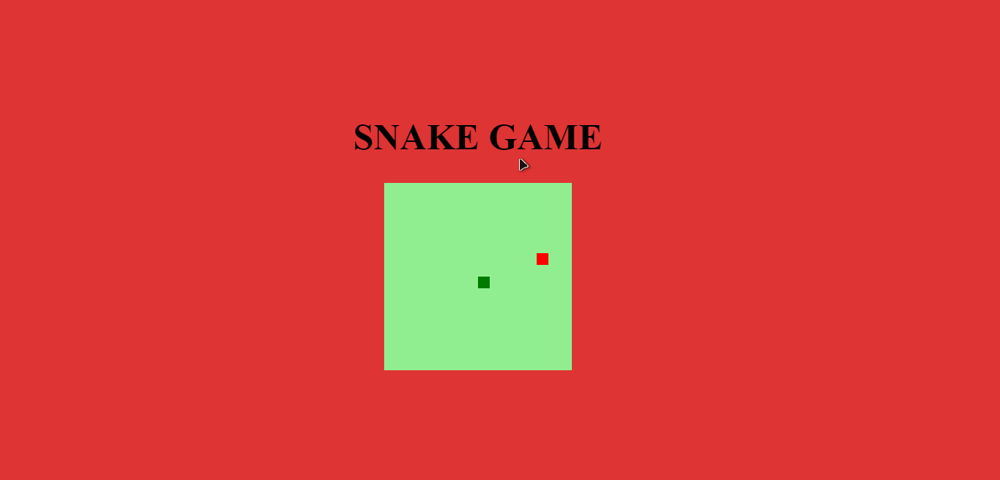

<h1 align="center">
   🐍SNAKE-GAME🐍
</h1>

<h4 align="center">
  💻 Simple snake game to remember great childhood moments
</h4>

## Photo 🎴

   

   
   
  
   

   

   
   <a href="#on">On</a> .
   <a href="#roadmap">Roadmap</a> .
   <a href="#technologies">Technologies</a> .
   <a href="#photo">Photo</a> . 
   <a href="#author">Author</a> 
   
 

   
 ## On ✔
     
     
   
  This is a project to recreate the snake game, for the completion of the Digital Innovation One course. 

   
   
   
   
   
   
 ## Roadmap 🗺
   
   
 I really missed the games that marked the 90s, when I decided
   making this application, even though it is simple and certainly too much fun and tests
   your skills!

   
   
## Technologies 🚀
   
   <h3 align="center"> Technologies used in the project 🙃 </h3>
   
   

- [HTML](https://www.w3schools.com/html/)
- [CSS](https://www.w3schools.com/css/)
- [JavaScript](https://www.javascript.com/)
   
 
 
   
## Author 🙋🏾‍♂️
   
 Hello, my name is João.   Follow me on <a href="https://www.linkedin.com/in/joaosoaressilva/" target="_blank">Linkedin</a> to see more about the projects I post.!

   
